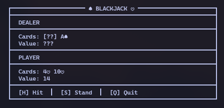
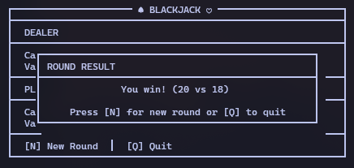

# Rustjack

Minimalist TUI-based blackjack game in Rust with `crossterm`.



## How to play
Run the program with:

```bash
cargo run
```

Then follow the on-screen controls. 

Buttons are mapped with the initial keys of the corresponding game actions such as `H` to hit, `S` to stand, `N` for new round, and `Q` to quit.

